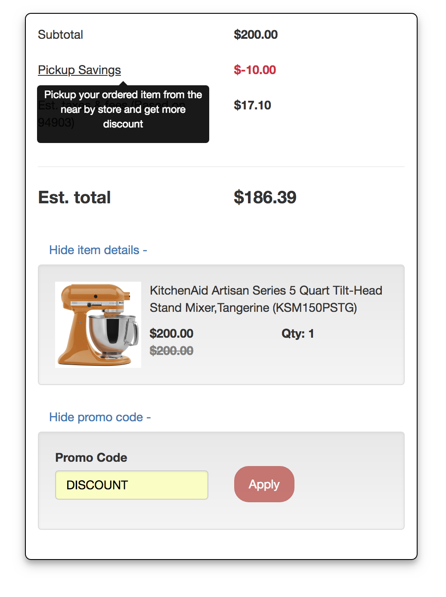
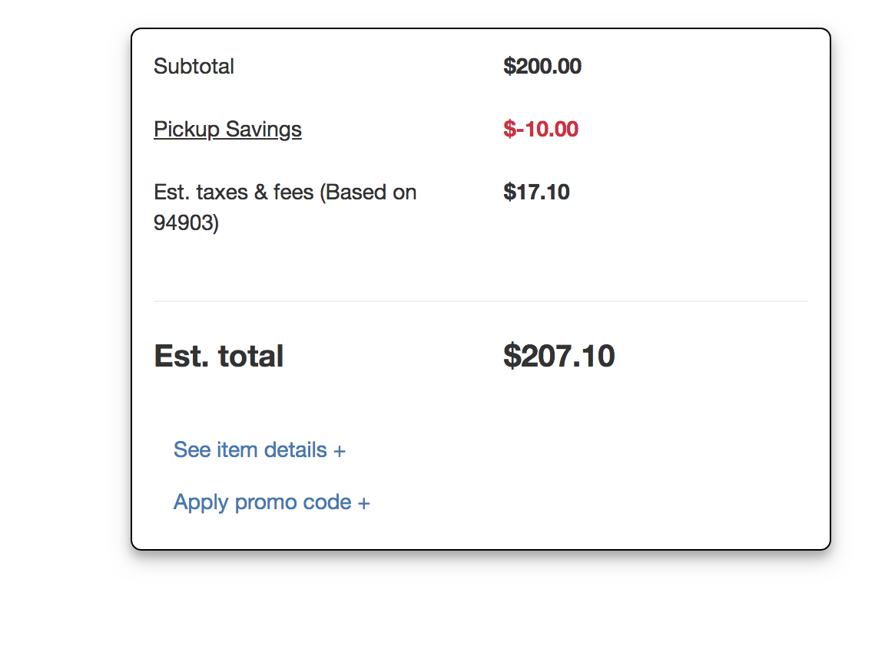
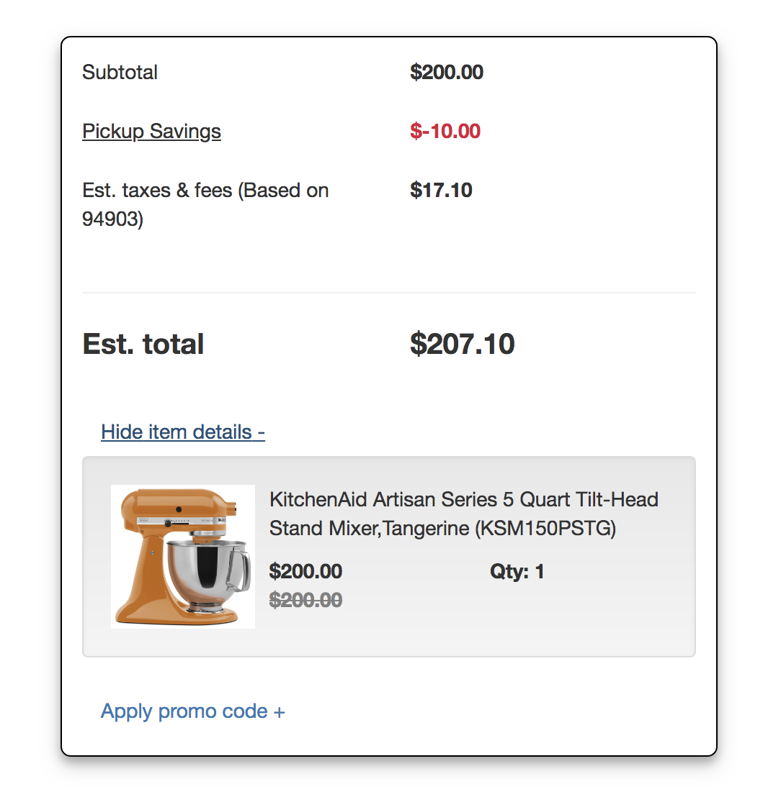
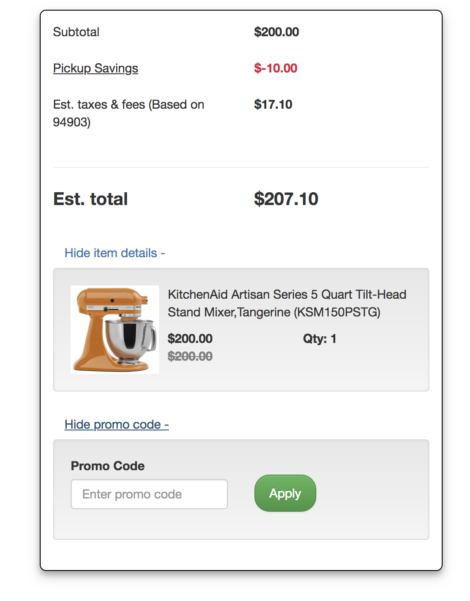
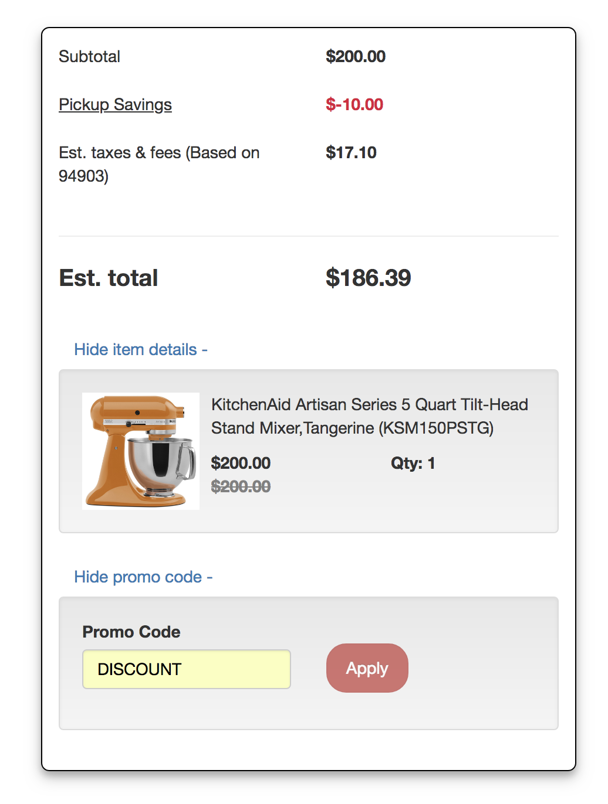

# React & Redux Shopping Cart/Purchase Summary :

App is desgined to display purchase summary of the items with discounts

## Motivation :

Replicate e-commerse site's shopping cart .

## Technology,Frameworks & APIs Used:

React,Redux,Redux-Thunk,Bootstrap,Webpack,Babel

## How to install and run the app :

1.  you clone the app from git hub
2.  then go to the folder name 'client'.
3.  then run 'npm install' in command line
4.  once installation completed . do 'npm run start'

### \*\*\*\* Note if you are planing to test the app in Safari or FireFox or IE , Please remove the Redux-Chrome extension in 'store.js' file.

### Initial Cart View

### Item Detail View

### Promo View

### After Promo Applied View

